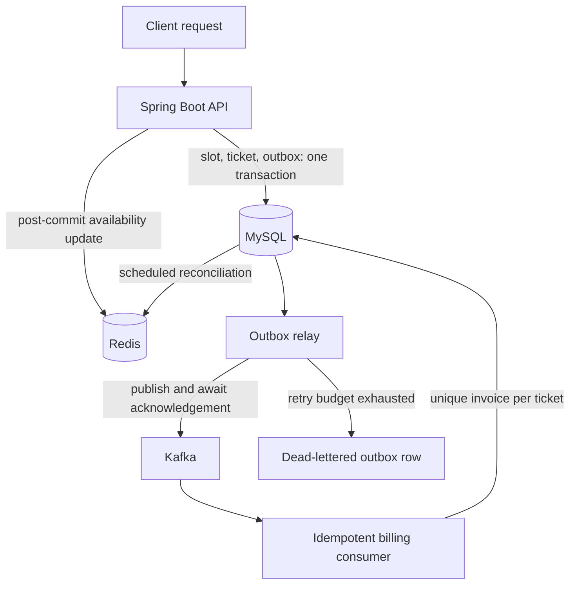

# Parking Management System

[](https://github.com/Shubhank2604/Park_/actions/workflows/ci.yml)

A modular Spring Boot backend for parking allocation, vehicle entry and exit, billing, authentication, Redis-backed availability, and reliable Kafka event delivery.

The system is designed around the failure modes that matter in an event-driven workflow: concurrent slot allocation, database/event consistency, broker failures, duplicate delivery, poison events, and cache drift.

## Reliability guarantees

| Failure mode | Design response | Verification |
|---|---|---|
| Two requests attempt to allocate the same slot | MySQL selects a compatible free slot under a pessimistic write lock and commits the slot and ticket together | Repository and service tests exercise locked allocation |
| The process stops after committing parking state but before publishing Kafka | The state change and outbox intent share one MySQL transaction | Outbox serialization and relay tests |
| Kafka temporarily rejects or fails a send | The relay waits for broker acknowledgement and retries with bounded exponential backoff | Acknowledgement and retry tests |
| A permanently invalid event retries forever | A configurable retry budget moves exhausted events to an explicit dead-letter state and preserves the last error | Dead-letter state and relay-selection tests |
| Kafka redelivers a vehicle-exit event | Billing is idempotent and the database enforces one invoice per ticket | Duplicate-delivery billing tests |
| Redis misses an update or restarts | A scheduled reconciler atomically rebuilds free-slot sets and counters from MySQL | Free, occupied, stale, and empty-state reconciliation tests |

## Architecture

The application is a modular monolith:

- `auth`: JWT authentication and role-based access
- `lot`: parking lots, levels, slots, allocation, and cached availability
- `ticket`: vehicle entry and exit
- `billing`: tariffs, invoices, and payments
- `outbox`: durable event intent, relay, retries, and dead-letter state
- `infra`: Redis and Kafka configuration
- `common`: shared DTOs, events, and optional local demo data



### Allocation and delivery flow

1. Select the first compatible free slot under a pessimistic database write lock.
2. Create the ticket, mark the slot occupied, and persist Kafka publication intent in the same MySQL transaction.
3. Update Redis only after the database commit succeeds.
4. Relay pending outbox rows in batches and mark them published only after Kafka acknowledges the send.
5. Retry transient failures with bounded exponential backoff; dead-letter events that exhaust the configured attempt budget.
6. Consume exit events idempotently so redelivery cannot create a second invoice for the same ticket.
7. Periodically replace Redis availability sets and counters from authoritative MySQL state.

## Consistency boundaries

- **MySQL is authoritative.** Redis accelerates availability reads but never allocates a slot, so stale cache data cannot create a duplicate database allocation.
- **Event delivery is at least once.** The transactional outbox prevents a committed state change from losing its publication intent; consumers must still tolerate redelivery.
- **Billing is protected against redelivery.** An existence check and unique invoice-per-ticket constraint prevent duplicate invoices.
- **Dead-lettering is inspectable, not automated recovery.** Exhausted events retain their last error in MySQL and leave the relay queue, but the project does not yet expose automatic replay or an operator API.
- **Schema evolution is currently application-managed.** Hibernate uses `ddl-auto: update`; production deployment would require versioned migrations such as Flyway or Liquibase.

## Technology

Java 17 · Spring Boot 3.2 · Spring Security · Spring Data JPA · MySQL 8 · Redis 7 · Kafka · Maven · Docker Compose · GitHub Actions

## Main APIs

| Capability | Endpoint |
|---|---|
| Login | `POST /api/auth/login` |
| Register | `POST /api/auth/register` |
| List parking lots | `GET /api/lots` |
| Check availability | `GET /api/lots/{id}/availability?type=CAR` |
| Vehicle entry | `POST /api/entry` |
| Vehicle exit | `POST /api/exit` |
| Fetch invoice | `GET /api/invoices/{ticketId}` |
| Process payment | `POST /api/pay/{invoiceId}` |

Protected endpoints require `Authorization: Bearer <token>`.

## Local setup

Requirements: Java 17+, Maven, and Docker.

1. Create a local configuration file:

   ```bash
   cp .env.example .env
   ```

2. Replace every `replace_...` value. Generate a strong JWT secret rather than reusing a password:

   ```bash
   openssl rand -base64 48
   ```

3. Start MySQL, Redis, Kafka, and ZooKeeper:

   ```bash
   docker compose up -d
   ```

4. Run the application:

   ```bash
   mvn spring-boot:run
   ```

Spring loads the local `.env` file as properties. The file is ignored by Git and must never be committed.

## Optional demo data

Demo accounts and sample parking data are disabled by default. To enable them locally, set:

```env
SEED_DATA_ENABLED=true
SEED_ADMIN_PASSWORD=choose_a_local_password
SEED_ATTENDANT_PASSWORD=choose_a_local_password
SEED_USER_PASSWORD=choose_a_local_password
```

The application refuses to seed users when an enabled demo password is empty. Never enable these accounts in a shared or production environment.

## Configuration

| Variable | Default | Purpose |
|---|---:|---|
| `AVAILABILITY_RECONCILE_DELAY_MS` | `60000` | Interval for rebuilding Redis availability from MySQL |
| `AVAILABILITY_RECONCILE_INITIAL_DELAY_MS` | `5000` | Initial reconciliation delay |
| `OUTBOX_POLL_DELAY_MS` | `1000` | Delay between outbox relay polls |
| `OUTBOX_MAX_ATTEMPTS` | `8` | Publish attempts before dead-lettering |
| `JWT_EXPIRATION_MS` | `86400000` | JWT lifetime |

Database, Redis, Kafka, JWT, and demo-seed settings are documented in `.env.example`.

## Verification

```bash
mvn verify
```

GitHub Actions runs the same command for every pull request and every push to `main`. The focused suite covers allocation locking, outbox serialization, broker acknowledgement, retry and dead-letter transitions, idempotent billing, and Redis reconciliation.

## Production hardening roadmap

The core consistency mechanisms are implemented. Remaining operational work is deliberately narrower:

- replace Hibernate-managed schema updates with versioned database migrations;
- add Testcontainers coverage against real MySQL, Redis, and Kafka services;
- add concurrent load and failure-injection tests;
- expose metrics and alerts for outbox lag, retries, dead-letter counts, and reconciliation failures; and
- add authenticated inspection and controlled replay tooling for dead-lettered events.

## License

Released under the [MIT License](LICENSE).
